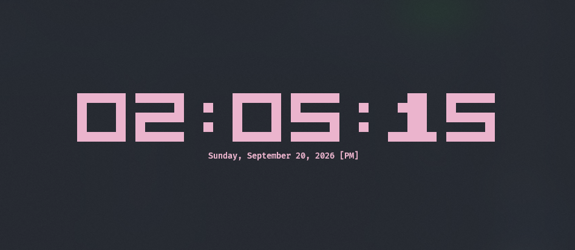

# 🕒 TerminalClock

A clean, minimalist, and aesthetic digital clock for your terminal, written in Rust. Features large pixel-style block digits, responsive centering, multiple color themes, and 12-hour / 24-hour format switching.

---

<p align="center">
  
</p>

---

## ✨ Features

- **Large Pixel-Art Digits**: Crisp 5x5 block matrix font using Unicode blocks (`██`) for a retro-digital aesthetic.
- **Curated Color Themes**: Includes several handpicked pastel and vibrant themes (Pastel Pink, Lavender, Cyan, Emerald Green, Amber, Pure White).
- **12h / 24h Toggle**: Seamlessly switch between standard 12-hour format (with `[AM]` / `[PM]`) and 24-hour military time.
- **Dynamic Auto-Centering**: Automatically computes the terminal viewport to keep the clock and date centered.
- **Comprehensive Date Display**: Displays full weekday, month, day, and year underneath the clock.
- **Safe Terminal State Management**: Employs an RAII guard (`TerminalGuard`) and custom panic hook to guarantee that alternate screen mode and raw terminal settings are cleanly restored upon exit.
- **Low Resource Usage**: Efficient event loop with non-blocking key polling and sub-second refreshes.

---

## ⌨️ Controls & Keybindings

| Key | Action |
| :--- | :--- |
| <kbd>q</kbd> or <kbd>Esc</kbd> | Exit the clock |
| <kbd>c</kbd> or <kbd>t</kbd> | Cycle color themes |
| <kbd>f</kbd> or <kbd>Space</kbd> | Toggle between 12-hour and 24-hour mode |

---

## 🎨 Available Themes

Switch themes anytime while running by pressing <kbd>c</kbd> or <kbd>t</kbd>:

1. **Pastel Pink** (`RGB(235, 180, 205)`)
2. **Lavender** (`RGB(200, 175, 240)`)
3. **Cyan** (`RGB(120, 220, 245)`)
4. **Emerald Green** (`RGB(130, 230, 165)`)
5. **Amber** (`RGB(255, 185, 90)`)
6. **Pure White** (`RGB(240, 240, 245)`)

---

## 🚀 Getting Started

### Prerequisites

Ensure you have [Rust and Cargo](https://www.rust-lang.org/tools/install) installed (Rust 2024 edition or later).

To check your installation:
```sh
cargo --version
rustc --version
```

### Clone and Run

1. **Clone the repository**:
   ```sh
   git clone https://github.com/KhornVictor/TerminalClock.git
   cd TerminalClock
   ```

2. **Run directly**:
   ```sh
   cargo run --release
   ```

3. **Build the binary**:
   ```sh
   cargo build --release
   ```
   The compiled binary will be available at:
   - **Linux/macOS**: `target/release/TerminalClock`
   - **Windows**: `target\release\TerminalClock.exe`

*(Optional)* You can copy the binary to a directory in your system `PATH` (such as `~/.cargo/bin` or `C:\Users\<User>\.cargo\bin`) to run `TerminalClock` from anywhere!

---

## 📁 Project Structure

```text
TerminalClock/
├── Cargo.toml         # Project metadata and dependencies (crossterm, chrono)
├── image.png          # Screenshot / preview image
├── src/
│   ├── main.rs        # Application entry point
│   ├── app.rs         # Event loop, input handling, and layout rendering
│   ├── digits.rs      # 5x5 boolean digit matrices & block rendering
│   └── theme.rs       # Theme definitions and color palette list
└── README.md          # Project documentation
```

---

## 🛠️ Adding Custom Themes

You can easily add your own color palettes in [`src/theme.rs`](src/theme.rs):

```rust
Theme {
    name: "Neon Purple",
    color: Color::Rgb { r: 180, g: 70, b: 255 },
},
```

Rebuild with `cargo build --release` and your new theme will be included in the cycle!

---

## 📄 License

This project is licensed under the [MIT License](LICENSE) (or choose your preferred license).
